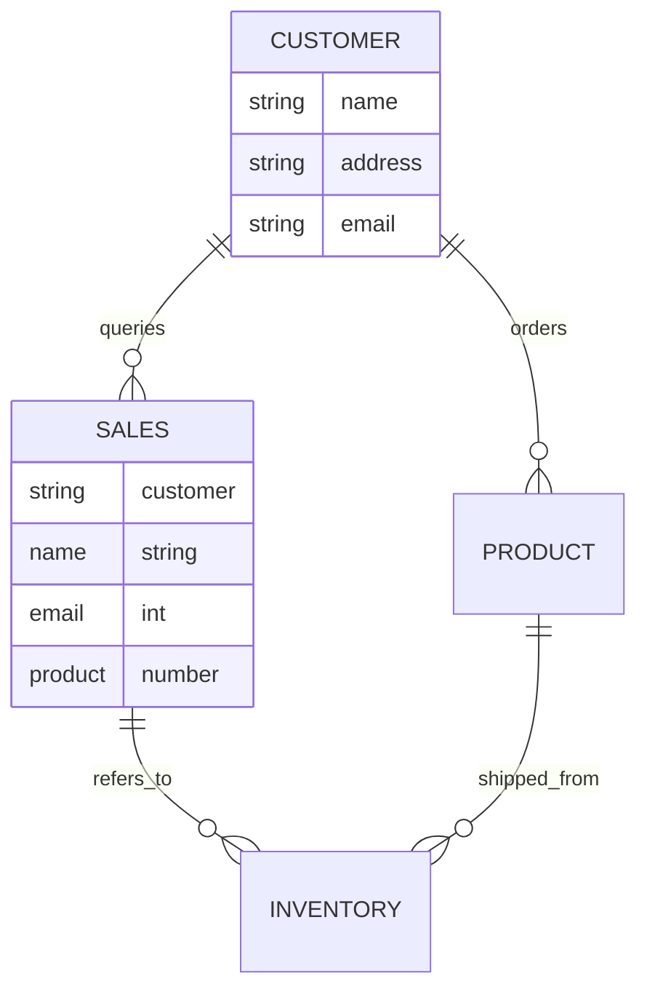

```mermaid
erDiagram
          CUSTOMER ||--o{ PRODUCT : orders
          CUSTOMER {
            string name
            string address
            string email
            }
            
            SALES ||--o{ INVENTORY : refers_to
            SALES {
            string customer name
            string email
            int product number
            }
          CUSTOMER ||--o{ SALES : queries
          PRODUCT ||--o{ INVENTORY : shipped_from
```
