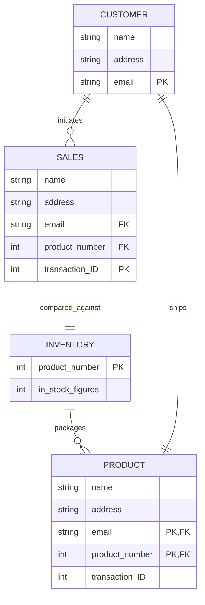

## Entities
* Customer: The customer is the start of the data tracking, they bring a unique name, address, email, etc.
* Sales: the transaction is the first relationship built in the diagram. Once the transaction is initiated then a data trail starts.
* Inventory: at some point the transaction needs to refer to the inventory available. In this example, we'll assume it is so the particular product in question could be provided to the Customer.
* Product: The product is the just the output of the three previous entities aligning and pulls data from each in the final delivery step.

## Keys / Relationships
* Customer email typically would act as a Primary Key in a list of customers. This would allow for some variation in names and changes in addresses and reduce in duplication of customer names.
* The product number would be a Primary Key in the Inventory entity.
* the Sales transaction would contain those two pieces of information but would be a foreign key for this entity.
* The Product entity would be a combination of the primary email and product number creating a unique crossroads for those pieces of data. 
